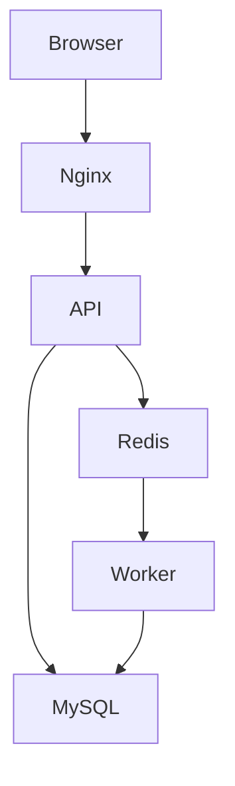

# 🐳 Laboratorio Docker – Arquitectura Asíncrona Multicontenedor

## 📌 Descripción general

Este laboratorio propone el despliegue de una **arquitectura multicontenedor con Docker Compose**, basada en un sistema de **procesamiento asíncrono de tareas**.

El objetivo es que el alumnado comprenda y razone:
- la separación de responsabilidades entre contenedores
- la comunicación interna en Docker
- el uso de colas de mensajes
- la persistencia de datos
- la asincronía real en sistemas distribuidos

---

## 🧠 Escenario funcional

El sistema permite:
1. Crear tareas desde una interfaz web
2. Almacenar las tareas en una base de datos
3. Encolar las tareas para su procesamiento
4. Procesarlas de forma asíncrona mediante workers
5. Visualizar el estado de las tareas en tiempo real

Estados posibles de una tarea:
- `PENDIENTE`
- `PROCESANDO`
- `COMPLETADA`

---

## 🧱 Arquitectura del sistema

El sistema está compuesto por los siguientes contenedores:

### 🔹 Frontend (Nginx)
- Sirve contenido estático (HTML + JavaScript)
- Permite crear tareas y consultar su estado
- Consume la API REST
- Expone el puerto 80

### 🔹 API Backend (Java + Spring Boot)
- Arquitectura MVC
- Endpoints REST
- Persistencia con JPA / Hibernate
- Inserta tareas en una cola Redis
- Expone el puerto 8080

### 🔹 Redis
- Actúa como **cola de tareas**
- Desacopla la API del procesamiento pesado
- Comunicación interna entre contenedores
- No expone puertos al exterior

### 🔹 Worker (Python)
- Proceso en background
- Consume tareas desde Redis
- Simula trabajo pesado
- Actualiza el estado en MySQL
- No expone puertos

### 🔹 MySQL
- Base de datos relacional
- Persistencia del estado de las tareas
- Compartida por la API y los workers
- Usa volúmenes para persistencia de datos

---

## 📁 Estructura del proyecto

```text
docker-async-lab/
│
├── api/
│   ├── Dockerfile
│   ├── pom.xml
│   └── src/
│       └── main/
│           ├── java/com/example/api/
│           │   ├── ApiApplication.java
│           │   ├── controller/TaskController.java
│           │   ├── model/Task.java
│           │   ├── repository/TaskRepository.java
│           │   └── service/QueueService.java
│           └── resources/
│               └── application.properties
│
├── worker/
│   ├── Dockerfile
│   ├── requirements.txt
│   └── worker.py
│
├── frontend/
│   ├── Dockerfile
│   ├── nginx.conf
│   └── html/
│       └── index.html
│
├── docker-compose.yml
├── .env
└── README.md
```

## Esquema de la arquitectura
